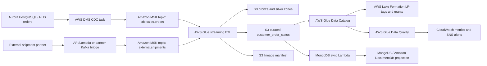

# Architecture

## Logical Flow

## AWS Native Services

- **Amazon MSK:** Durable Kafka backbone for CDC and partner events.
- **AWS DMS:** Full-load plus CDC replication from PostgreSQL/Aurora to Kafka.
- **AWS Glue Streaming:** Spark Structured Streaming job that reads Kafka micro-batches and writes governed lakehouse datasets.
- **AWS Glue Data Catalog:** Central metadata layer for bronze, silver, curated, and governance tables.
- **AWS Lake Formation:** LF-tags and permissions for persona-based data access.
- **AWS Glue Data Quality:** DQDL rulesets for curated table validation.
- **Amazon S3 and AWS KMS:** Encrypted lakehouse storage and artifact storage.
- **AWS Lambda:** MongoDB projection sync and lineage event emission.
- **Amazon DynamoDB:** Idempotent watermarks for MongoDB synchronization.
- **Amazon CloudWatch and SNS:** Metrics, logs, dashboards, and alert fan-out.
- **AWS Secrets Manager:** MongoDB URI and MSK SCRAM credentials.

## Security Model

| Layer | Control |
| --- | --- |
| Kafka auth | MSK provisioned cluster with SASL/SCRAM for DMS and IAM for Glue/app clients |
| Kafka network | Private subnets, security groups, TLS broker traffic |
| Lake storage | S3 bucket encryption with customer-managed KMS key |
| Metadata | Glue Data Catalog tables tagged by domain and sensitivity |
| Access | Lake Formation LF-tag policies for analyst, steward, and engineer roles |
| Secrets | MongoDB and SCRAM credentials in Secrets Manager |
| Operations | Least-privilege IAM roles per Glue, Lambda, DMS, and client persona |

## Data Zones

| Zone | Purpose | Example path |
| --- | --- | --- |
| Bronze | Raw CDC and partner event preservation | `s3://bucket/bronze/dms_cdc/` |
| Silver | Normalized latest entity state | `s3://bucket/silver/orders/` |
| Curated | Contracted data product for analytics and ops | `s3://bucket/curated/customer_order_status/` |
| Governance | DQ results, lineage events, run metadata | `s3://bucket/governance/lineage/` |

## Critical Tradeoff

AWS DMS Kafka target endpoints support Amazon MSK, but the DMS Kafka target does not support MSK IAM access control. This project therefore uses provisioned MSK with SCRAM enabled for the DMS target and IAM enabled for clients that can use it.
